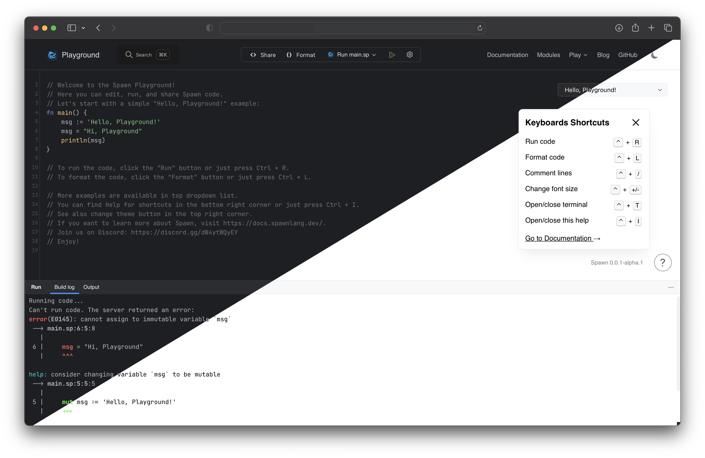

# Spawn Playground: Run, Edit, Share Spawn Code Online

The [Spawn Playground](https://play.spawnlang.dev) is a place where you can
run, edit and share Spawn code online.



## Features

- Nice and clean UI
- Powerful editor with syntax highlighting and auto-completion
- Ability to [run code as tests](https://docs.spawnlang.dev/tools/playground.html#test)
- Ability to [see generated C code](https://docs.spawnlang.dev/tools/playground.html#show-generated-c-code)
  for passed Spawn code
- Pass [flags](https://docs.spawnlang.dev/tools/playground.html#pass-arguments-to-compiler)
  to Spawn compiler and binary
- [Shareable](https://docs.spawnlang.dev/tools/playground.html#share-code) code
  and editor state via URL or local storage

## Developing

First, clone the repository:

```bash
git clone https://github.com/spawnlang/playground
cd playground
```

Install Spawn dependencies:

```bash
npm run install-server-deps
```

### Quick, containerized local development (recommended)

#### Using Docker Compose

```bash
npm run run-docker
```

then access the playground at <http://localhost:5555>

### Run the playground locally

```bash
npm run local-serve
```

then access the playground at <http://localhost:5555>

## Server API

See [server/README.md](./server/README.md) for more information about the server
API.

## License

This project is under the **MIT License**.
See the
[LICENSE](https://github.com/spawnlang/playground/blob/main/LICENSE)
file for the full license text.
